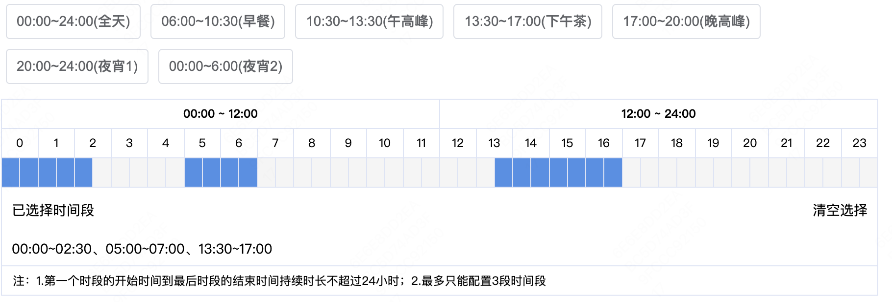

## 拖拽时间选择器



### Attributes

| 参数             | 说明             | 类型    | 默认值 | 备注                                                         |
| ---------------- | ---------------- | ------- | ------ | ------------------------------------------------------------ |
| value / v-model  | 绑定值           | IValue  |        | 必填值                                                       |
| needCustomPeriod | 控制时间段区显隐 | boolean | false  | 时间段区可通过点击快速选中常规时段<br />可选值参考**ITimePeriod** |
| range            | 时间范围         | number  | 48     | 48 代表 48 小时，也就是 2 天                                 |
| disabled         | 禁用             | boolean | false  | 值为 true 则不可选择时间                                     |
| step             | 步长             | number  | 30     | 30 分钟，每个小时会被分割为 2 格（60 / step）                |

```ts
type IValue = Array<{
  startTime: string;
  endTime: string;
}>;
```

### Events

| 事件名称                  | 说明                     | 回调参数             |
| ------------------------- | ------------------------ | -------------------- |
| change                    | 值变化时触发             | (Value: IValue)      |
| custom-time-period-change | 点击时间段区的按钮时触发 | (Value: ITimePeriod) |
| on-clear                  | 点击清空选择时触发       |                      |

```ts
type ITimePeriod = {
  timePeriod: string; // "00:00~24:00"
  label: string; // "全天" "早餐" "午高峰" "下午茶" "晚高峰" "夜宵1" "夜宵2"
  type: string; // "allDay"
  range: [number, number]; // [0, 47] 从第0格到第47格
  selected: boolean; // false
};
```
